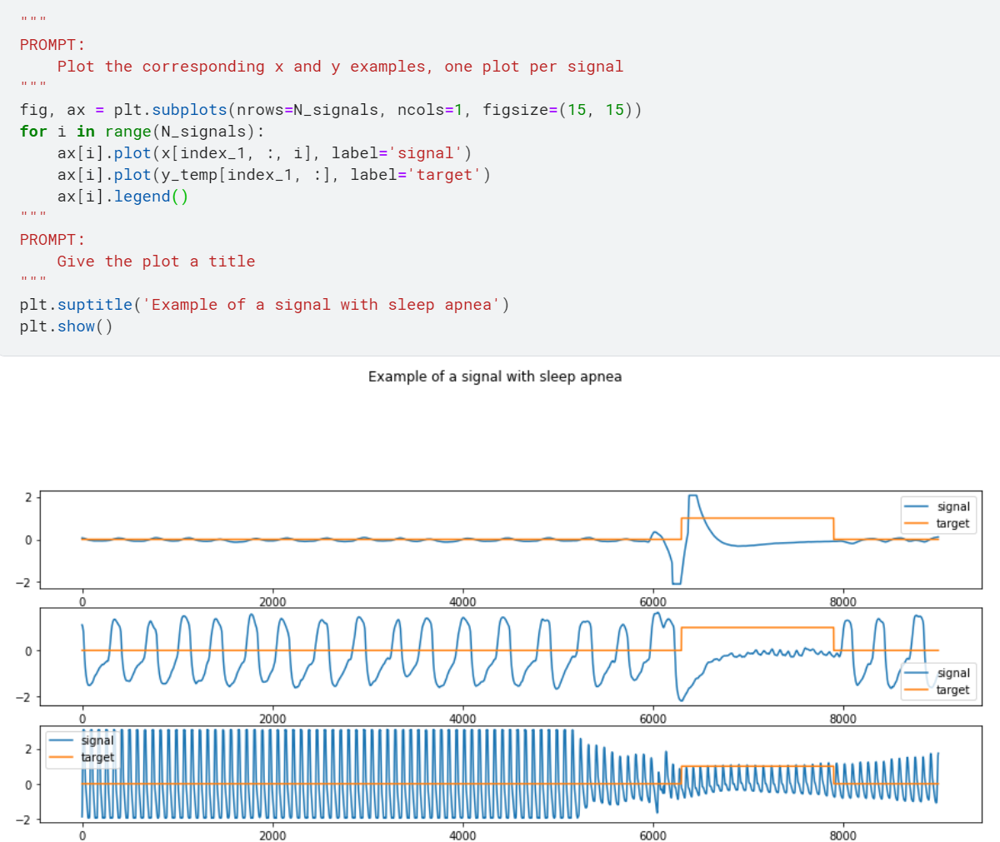

# Coding with Codex
Solving various coding problems with the help of OpenAI's Codex

**Every piece of code is written by Codex unless I specify otherwise**

The prompts given to Codex are written as comments in the code

Here is an example:

